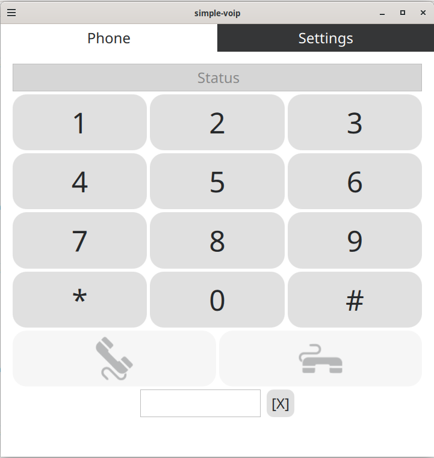
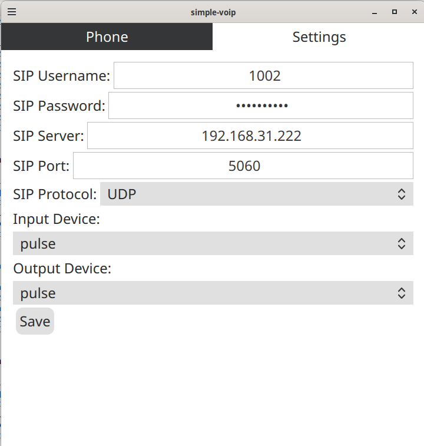

# simple-voip

Simple SIP Softphone using Qt5 QML (Quick) UI and PJSIP library.
Based on MetaVoIP v1.1.0 by Dominik Fehr. Original versions available - check GIT tags.




## Build 

### Linux
#### Install PJSIP library

Run `pjproject_install_from_git.sh` to install pjsip v2.15.1 to /usr/

#### Get binaries

For binaries refer to [aqtinstall](https://github.com/miurahr/aqtinstall)

##### Build from source

Install dependencies. Use this guide [Building_Qt_5_from_Git](https://wiki.qt.io/Building_Qt_5_from_Git)

And then just copy this block and paste to console. At the end **Qt v5.15.8** should appear at `/opt/Qt/5.15.8/gcc_64`

```shell
git clone git://code.qt.io/qt/qt5.git \
&& cd qt5 \
&& git checkout v5.15.8-lts-lgpl \
&& perl init-repository \
&& cd .. \
&& mkdir qt_v5.15.8_build && cd qt_v5.15.8_build \
&& ../qt5/configure -developer-build -opensource -nomake tests -confirm-license -prefix /opt/Qt/5.15.8/gcc_64 -skip qtlocation \
&& make -j$(nproc) \
&& sudo make install
```

#### CMake variant

1. Run `cmake_build.sh`. Fix Qt path in script to appropriate. The binary should appear in **build/** directory.
2. To install app run `cmake --install build/`. This will copy simple-voip to **/usr/bin/simple-voip**
3. To build basic debian package using cpack run `cd build/; cpack`. This should create simple-voip-x.y.z-Linux.deb in **build/** dir.
4. TO clean remove **build/** directory.

#### QMake variant
1. Run `qmake_build.sh`. Fix QMAKE_BIN path in script to appropriate.
2. To clean run `make distclean`

## Note

The W32 and android versions build are in TBD state. Feel free to fix it, or contact me to fix this.
